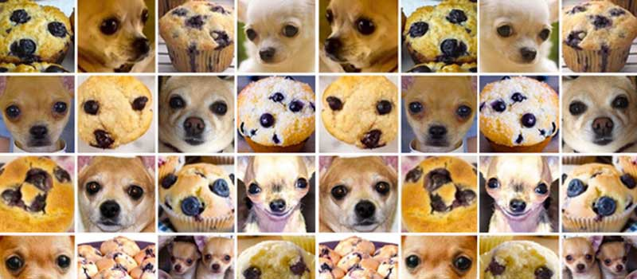

# Redes Adversárias Generativas (GANs)

## Referência Principal
-https://arxiv.org/pdf/1511.06434
-https://github.com/NSTiwari/DCGANs-using-Keras-and-TensorFlow


## 1. Introdução às GANs




### 1.1 Definição
As **Generative Adversarial Networks (GANs)** são uma classe de algoritmos de aprendizado de máquina não supervisionado, introduzidas por Ian Goodfellow em 2014. O conceito fundamental é baseado na teoria dos jogos, onde dois modelos neurais competem entre si:

- **Gerador (G)**: Cria dados sintéticos tentando enganar o discriminador
- **Discriminador (D)**: Distingue entre dados reais e sintéticos


### 1.2 Analogia do Falsificador
Imagine um falsificador (Gerador) tentando criar notas falsas e um detetive (Discriminador) tentando identificá-las. Ambos melhoram suas habilidades através da competição até que as notas falsas se tornem indistinguíveis das reais.


## 2. Arquitetura das GANs

### 2.1 Componentes Principais

```
Ruído Aleatório (z) → GERADOR (G) → Dados Sintéticos
                                         ↓
Dados Reais → DISCRIMINADOR (D) ← Dados Sintéticos
              ↓
         Classificação (Real/Falso)
```


### 2.2 Função Objetivo

Esse é o coração da rede **GAN** (Generative Adversarial Network): a função V(D, G) mede o “sucesso” dos dois jogadores (o Gerador G e o Discriminador D) no jogo adversarial. Todo o treinamento da GAN se resume a otimizar (maximizar ou minimizar) essa função, que é o “campo de batalha” onde G e D competem.

$$
\min_G \max_D V(D,G) = \mathbb{E}_{x \sim p_{dados}}[\log D(x)] + \mathbb{E}_{z \sim p_z}[\log(1 - D(G(z)))]
$$

```
min max V(D,G) = E[log D(x)] + E[log(1 - D(G(z)))]
 G   D
```

Onde:
- **D(x)**: probabilidade do discriminador classificar x como real;
- **G(z)**: dados gerados a partir de um ruído z;
- **E**: valor esperado (média ponderada dos resultados), ou seja, “quanto em média esperamos obter” ao repetir esse processo.


**Papel no Treinamento:**
- **Discriminador**: tenta maximizar V(D, G) (ou seja, acertar quem é real e quem é falso).
- **Gerador**: tenta minimizar V(D, G) (ou seja, enganar o discriminador).


## 3. Processo de Treinamento

### 3.1 Algoritmo de Treinamento

1. **Treinar Discriminador**:
   - Apresentar dados reais (label = 1)
   - Apresentar dados sintéticos do gerador (label = 0)
   - Maximizar a capacidade de distinção

2. **Treinar Gerador**:
   - Gerar dados sintéticos
   - Tentar enganar o discriminador (label = 1 para dados sintéticos)
   - Minimizar a capacidade do discriminador de detectar falsificações

3. **Repetir** até convergência

### 3.2 Equilíbrio de Nash
O treinamento busca atingir um equilíbrio onde:
- G gera dados indistinguíveis dos reais
- D não consegue mais distinguir real de sintético (50% de acerto)


## 4. Aplicações em Visão Computacional

### 4.1 Geração de Imagens
- **Faces sintéticas**: CelebA, FFHQ
- **Arte digital**: DeepArt, StyleGAN
- **Paisagens**: Geração de cenários realistas

### 4.2 Transferência de Estilo
- **CycleGAN**: Conversão de domínios (cavalos ↔ zebras)
- **Pix2Pix**: Tradução de imagens (esboços → fotos)

### 4.3 Super-resolução
- **SRGAN**: Aumentar resolução de imagens
- **ESRGAN**: Versão aprimorada com melhor qualidade

### 4.4 Inpainting
- Preenchimento de regiões removidas em imagens
- Restauração de fotografias antigas

## 5. Variações das GANs

### 5.1 DCGAN (Deep Convolutional GAN)
- Utiliza camadas convolucionais
- Melhor estabilidade de treinamento
- Geração de imagens de alta qualidade

### 5.2 Conditional GAN (cGAN)
- Geração condicionada por rótulos
- Controle sobre o tipo de saída gerada

### 5.3 StyleGAN
- Controle detalhado sobre características da imagem
- Interpolação suave entre diferentes estilos

### 5.4 CycleGAN
- Tradução de imagens sem pares de treinamento
- Preservação da estrutura da imagem original


## 6. Desafios e Limitações

### 6.1 Problemas Comuns
- **Mode Collapse**: Gerador produz apenas algumas variações
- **Training Instability**: Dificuldade de convergência
- **Vanishing Gradients**: Discriminador muito forte

## 7. Métricas de Avaliação

### 7.1 Inception Score (IS)
- Mede qualidade e diversidade das imagens geradas
- Baseado na classificação com rede Inception

### 7.2 Fréchet Inception Distance (FID)
- Compara distribuições de features entre imagens reais e sintéticas
- Menor FID indica melhor qualidade

### 7.3 Avaliação Humana
- Testes de Turing visuais
- Comparação subjetiva de qualidade


## 8. Implementação Prática

### 8.1 Datasets Populares
- **MNIST**: Dígitos manuscritos
- **CelebA**: Faces de celebridades
- **FFHQ**: Faces de alta qualidade

## 11. Recursos Adicionais

### Tutoriais Online
- TensorFlow GAN Tutorial
- PyTorch GAN Examples
- Papers With Code - GANs

### Datasets
- [CelebA](http://mmlab.ie.cuhk.edu.hk/projects/CelebA.html)
- [FFHQ](https://github.com/NVlabs/ffhq-dataset)
